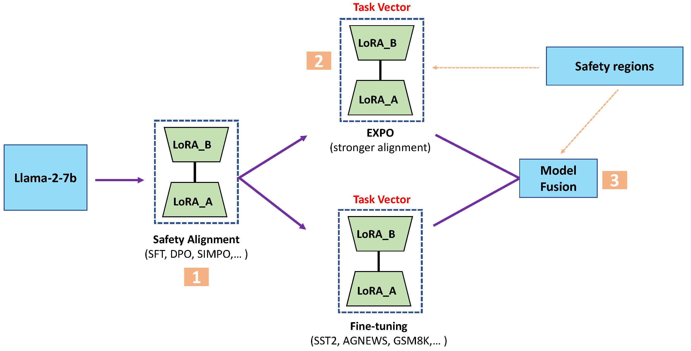

# Assessing the safety re-alignment via model fusion 

# 1. Safety Alignment
### Training Approach
- [x] [SFT]
- [x] [DPO]
- [x] [SimPO]

### Datasets
[PKU-Alignment](https://huggingface.co/PKU-Alignment)

### Safety Evaluation
[beaver-dam-7b](https://huggingface.co/PKU-Alignment/beaver-dam-7b)

# 2. Downstream Task Fine-tuning

### Datasets
- [x] [SST2]
- [x] [AG_NEWS]
- [x] [GSM8K]
- [x] [Alpaca]

### Fine-tuning setting
- [x] harmful data ratio: clearn, 0.01, 0.05, 0.1, 0.2
- [x] harmful data size: 100, 500, 1000, 2000, 2500

### Safety Evaluation

# 3. Stronger Alignment ([EXPO](https://arxiv.org/abs/2404.16792))

### Source Model
- [x] [SFT]
- [x] [DPO]
- [x] [SimPO]

# 4. Model Fusion
### Base Methods
- [x] [Weight averaging]
- [x] [Task Arithmetic]
- [x] [TIES](http://arxiv.org/abs/2306.01708v2)
- [X] [Consensus TA](https://arxiv.org/abs/2405.07813)
- [X] [Consensus TIES](https://arxiv.org/abs/2405.07813)

### Fusion in the Safety Regions
- [x] [Neuron Level](https://arxiv.org/abs/2402.05162)
- [x] [Rank Level](https://arxiv.org/abs/2402.05162)
- [x] [Attention Level](https://arxiv.org/abs/2406.01563)