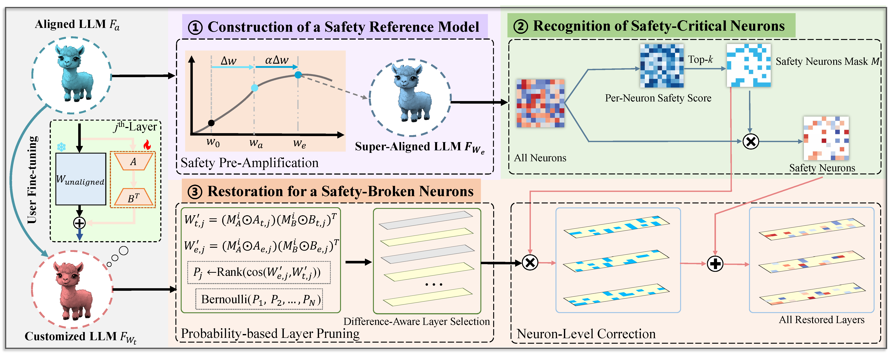

# Assessing the safety re-alignment via model fusion 

# 1. Safety Alignment
### Training Approach
- [x] [SFT]
- [x] [DPO]
- [x] [SimPO]

### Datasets
[PKU-Alignment](https://huggingface.co/PKU-Alignment)

### Safety Evaluation
[beaver-dam-7b](https://huggingface.co/PKU-Alignment/beaver-dam-7b)

# # 